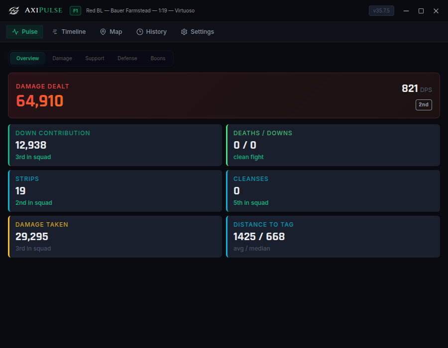
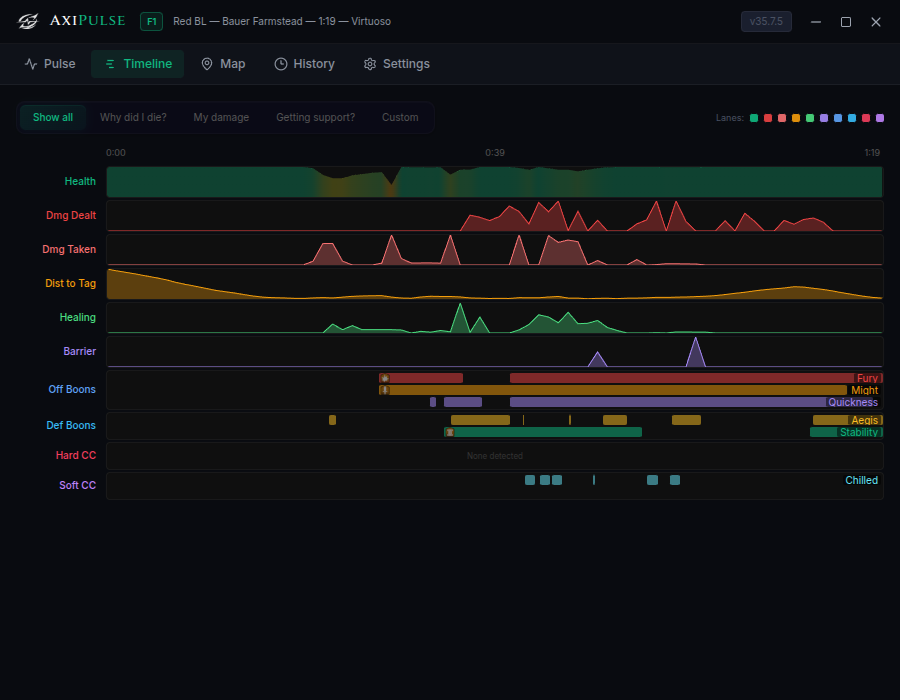

<p align="center">
  
</p>

<h1 align="center">AxiPulse</h1>

<p align="center">
  <strong>Personal GW2 combat analysis that runs beside your game, not in a browser tab.</strong>
</p>

<p align="center">
  <a href="https://github.com/darkharasho/axipulse/releases/latest"></a>
  <a href="https://github.com/darkharasho/axipulse/blob/main/LICENSE"></a>
  <a href="https://github.com/darkharasho/axipulse/releases"></a>
</p>

---

<p align="center">
  
</p>

<p align="center">
  
</p>

---

## See what happened. Know what to fix.

AxiPulse is a lightweight desktop companion that watches your arcdps log folder, parses each fight locally with Elite Insights, and shows you exactly how you performed — while the squad is still forming up for the next one.

No browser tabs. No uploads. No waiting. Drop it on a second monitor and let it work.

---

## Features

### Pulse — How am I doing?
The Pulse view gives you a per-fight snapshot of your individual performance. Damage, DPS, down contribution, strips, cleanses, healing — all ranked against your squad so you know where you stand. AxiPulse detects whether you played damage or support and adjusts the overview to surface the stats that matter most for your role.

### Timeline — What happened?
Scrub through a fight second by second. See your damage dealt, damage taken, distance to tag, incoming healing, boon uptimes, CC, and death/down events laid out on synchronized lanes. Click any moment to inspect what was happening across every metric at that exact time.

### Map — Where was I?
Watch a top-down replay of your squad's movement on the WvW map. Track positions, see where you went down, and understand how the fight flowed spatially. Each player is color-coded by profession with live boon state overlays.

### History — Fight log
Every parsed fight is saved and browsable. Quick-stats let you scan across a session at a glance, and clicking any entry loads the full Pulse, Timeline, and Map views for that fight.

### Automatic Elite Insights management
AxiPulse downloads, installs, and updates Elite Insights for you. On Linux it handles the .NET runtime too. You never touch a CLI or a config file.

### Auto-updates
AxiPulse checks for updates on launch and can install them in the background. One click to restart when a new version is ready.

---

## Quick start

### Download

Grab the latest release for your platform:

- **Linux** — [AppImage](https://github.com/darkharasho/axipulse/releases/latest)
- **Windows** — [Installer](https://github.com/darkharasho/axipulse/releases/latest)

### Prerequisites

- [arcdps](https://www.deltaconnected.com/arcdps/) installed in your Guild Wars 2 directory
- AxiPulse handles everything else — Elite Insights is downloaded and managed automatically

### Build from source

```bash
git clone https://github.com/darkharasho/axipulse.git
cd axipulse
npm install
npm run dev          # development
npm run build        # production build
```

---

## Tech stack

| Layer     | Technology                              |
|-----------|-----------------------------------------|
| Framework | Electron                                |
| Frontend  | React, TypeScript, Vite                 |
| Styling   | Tailwind CSS                            |
| Parser    | Elite Insights CLI (managed)            |
| Updates   | electron-updater                        |

---

## Contributing

Contributions are welcome. Fork the repo, create a branch, and open a PR.

```bash
git checkout -b my-feature
# make your changes
npm run build            # make sure it compiles
```

---

## License

See [LICENSE](LICENSE) for details.

---

<p align="center">
  <sub>Built for the commander who wants to know what happened before the next push.</sub>
</p>
